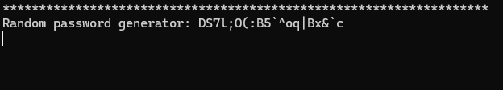
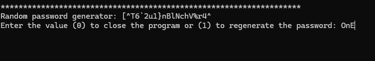
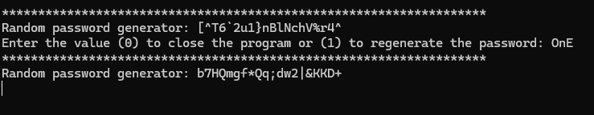

# 🔐 Random Password Generator

A modern C++ console application that generates secure random passwords while ensuring required character diversity.

The program generates passwords containing lowercase letters, uppercase letters, numbers, and special characters. It also includes robust input validation, randomized character placement, and password regeneration through a clean and simple command-line interface.

---

## ⬇️ Download

[](https://github.com/sooskes/password-randomizer.cpp/releases/latest)

Download the latest version from the **Releases** page.

The compiled `.exe` version does not require a pre-installed C++ compiler.


---

## ✨ Features

* 🔒 Generates secure random passwords
* 🔠 Includes uppercase and lowercase letters
* 🔢 Includes numbers
* 💠 Includes special characters
* 🎲 Randomized character placement
* ✅ Case-insensitive input validation
* 🔄 Instant password regeneration
* 💻 Clean console interface

---

## 📸 Preview

### Password Generation

Shows the program generating a complete password containing all required character types.



---

### Input Validation

Demonstrates the program handling different user inputs correctly.



---

### Password Regeneration

Shows generating a new password without restarting the application.



---

## 🛠 Built With

* C++
* Standard Template Library (STL)

Libraries used:

* `<iostream>`
* `<string>`
* `<vector>`
* `<ctime>`
* `<cstdlib>`
* `<thread>`
* `<chrono>`
* `<cctype>`

---

## 🚀 Getting Started

### Clone the repository

```bash
git clone https://github.com/sooskes/password-randomizer.cpp.git
```

### Compile

```bash
g++ -std=c++17 -O2 -static -static-libgcc -static-libstdc++ -o PasswordGenerator.exe src/main.cpp
```

### Run

```bash
PasswordGenerator.exe
```

---

## 📂 Project Structure

```text
Password-Randomizer/
│
├── screenshots/
│   ├── generation.png
│   ├── input-validation.png
│   └── regeneration.png
│
├── src/
│   └── main.cpp
│
├── LICENSE
└── README.md
```

---

## 🎯 Future Improvements

* Custom password length
* User-selectable character sets
* Password strength indicator
* Copy password to clipboard
* Save generated passwords to a file

---

## 👨‍💻 Author

**Ali Solhjoo**

Computer Engineering Student

GitHub: https://github.com/sooskes

---

## 📄 License

This project is licensed under the MIT License.
